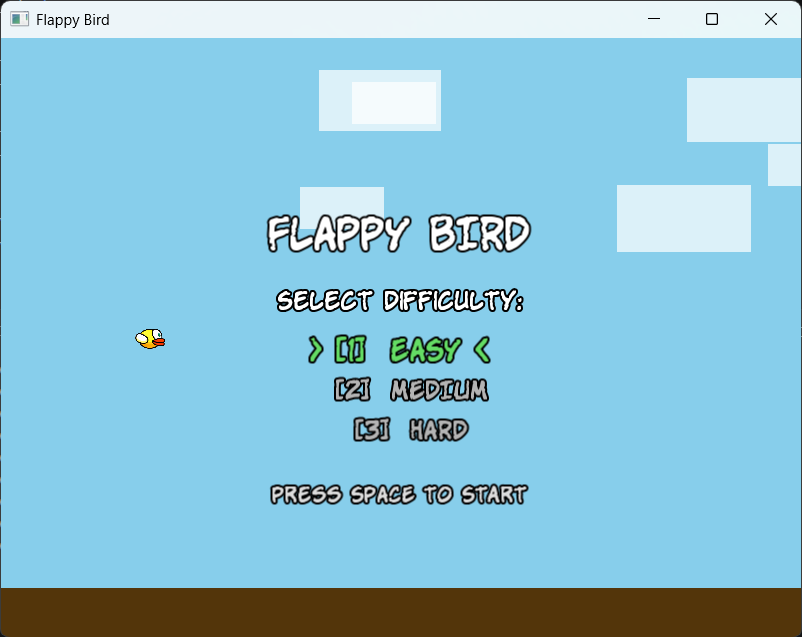
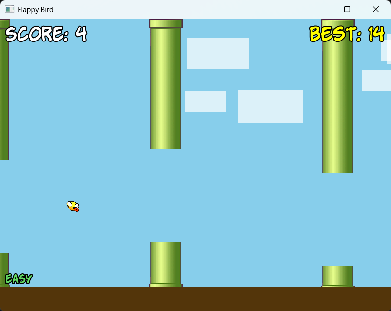
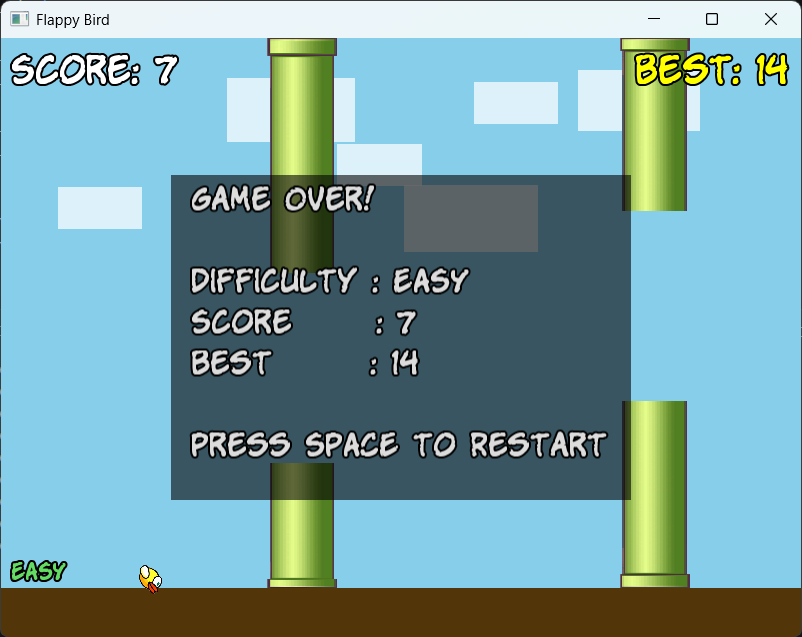

# Flappy Bird Game 🐦

A fully functional **Flappy Bird clone** developed in **C++ using SFML** featuring smooth gameplay, animated background movement, difficulty modes, collision detection, score tracking, and restart functionality.

---

## 🎮 Features

* Classic Flappy Bird gameplay
* Smooth bird physics and gravity system
* Pipe obstacle generation
* Easy / Medium / Hard difficulty modes
* Score and Best Score tracking
* Collision detection
* Dynamic background with moving clouds
* Restart system after death
* Keyboard and mouse controls
* Sprite-based rendering using SFML

---

## 📂 Project Structure

```bash
FLAPPY-BIRD-GAME/
│
├── Assets/
│   ├── fonts/
│   ├── graphics/
│   └── screenshots/
│
├── include/
│   ├── Bird.h
│   └── Pipe.h
│
├── Bird.cpp
├── Pipe.cpp
├── Game.cpp
│
└── README.md
```

---

## 🛠 Technologies Used

* **C++**
* **SFML 2.5+**
* Object-Oriented Programming
* Game Development Concepts

---

## 🎯 Gameplay Controls

| Key          | Action                 |
| ------------ | ---------------------- |
| `SPACE`      | Jump / Start / Restart |
| `LEFT CLICK` | Jump                   |
| `1`          | Easy Difficulty        |
| `2`          | Medium Difficulty      |
| `3`          | Hard Difficulty        |

---

## ⚙️ Difficulty Modes

| Difficulty | Pipe Speed | Gap Size |
| ---------- | ---------- | -------- |
| Easy       | Slow       | Large    |
| Medium     | Moderate   | Medium   |
| Hard       | Fast       | Small    |

---

## 🧠 Project Concepts Used

* Classes and Objects
* Encapsulation
* Collision Detection
* Game Loop
* Event Handling
* Sprite Rendering
* Arrays and Object Management
* Frame-based Animation Logic

---

## 🐦 Bird System

The `Bird` class handles:

* Gravity physics
* Jump mechanics
* Rotation animation
* Collision state
* Position updates

Implemented in:

* `Bird.h` 
* `Bird.cpp` 

---

## 🚧 Pipe System

The `Pipe` class manages:

* Random pipe generation
* Pipe movement
* Collision hitboxes
* Score detection
* Pipe recycling

Implemented in:

* `Pipe.h` 
* `Pipe.cpp` 

---

## 🎮 Main Game Logic

`Game.cpp` contains:

* Main game loop
* State management
* Difficulty handling
* Score system
* UI rendering
* Background animation
* Event processing

Source: 

---

## ▶️ How to Run

### 1️⃣ Install SFML

Download SFML from:

[SFML Official Website](https://www.sfml-dev.org/?utm_source=chatgpt.com)

---

### 2️⃣ Compile the Project

Example using **g++**:

```bash
g++ Game.cpp Bird.cpp Pipe.cpp -o Game ^
-lsfml-graphics -lsfml-window -lsfml-system
```

---

### 3️⃣ Run

```bash
./Game
```

Or execute:

```bash
Game.exe
```

---

## 📸 Screenshots


### Main Menu


### Gameplay


### Game Over Screen


Example:

* Main Menu
* Gameplay
* Game Over Screen

---

## 🚀 Future Improvements

* Sound effects and background music
* Animated bird sprites
* Pause menu
* High score file saving
* Mobile support
* Power-ups and achievements
* Better particle effects

---

## 👨‍💻 Author

**Neelakantha Sahu**

---

## 📜 License

This project is created for educational and learning purposes.
